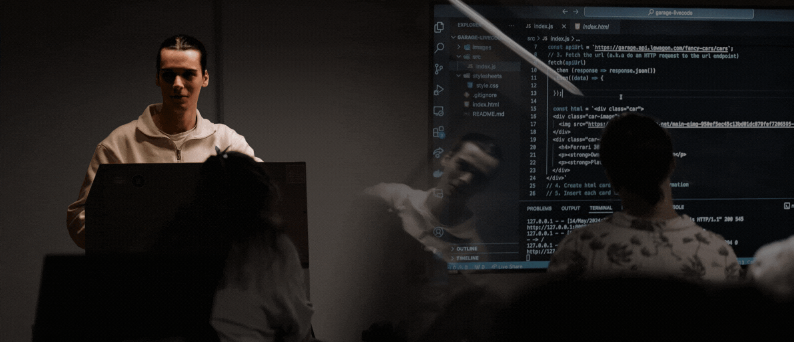

<h2>Heya! I'm Bernardo Campos</h2>

## 👨🏻‍💻 &nbsp;About Me
After studying Art for 3 years in high school i decided to take a big step in my life and moved alone to a different country, where i studied Games Art & Design in University. My time there made me grow as an individual both personally and professionally. The main key aspects that i got from this experience was how the industry works, Team Work and communication.

Subsequent to finishing University, I returned to Portugal and realized that my passion laid elsewhere, the Tech industry. During my time in University I had some introduction to this world. So I decided to join Le Wagon Web Development intense bootcamp, where I learned a lot of Technical skills but also soft skills.

&nbsp;

## 🛠 &nbsp;Languages & Tools

 
  
  
  
  
  
  
  
  
  
  

 
  
  
  

 
  
  
  
  
  
  
  

&nbsp;

## ⚙️ &nbsp;Stats

